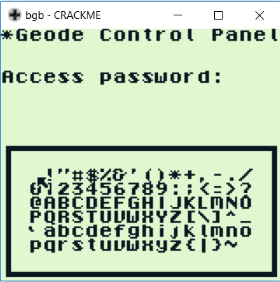

# NDH wargame 2018 : reverse 100

**Category:** reverse |
**Name:** geodegb |
**Solves:** 0 |
**Description:** Reverse a game boy game.

___
## TLDR
This challenge is about reversing a gameboy game to find a flag.

|  |

Flag: tH4TZ_4N_e4SY_NDH_fL4G

## Reverse

Using a gameboy [emulator/debugger](http://bgb.bircd.org/) we exported the asm code that you can access [here](code.asm).

A random extract:
```
ROM0:065F 83               add  e
ROM0:0660 E5               push hl
ROM0:0661 21 7B 15         ld   hl,157B
ROM0:0664 06 00            ld   b,00
ROM0:0666 4F               ld   c,a
ROM0:0667 09               add  hl,bc
ROM0:0668 7E               ld   a,(hl)
ROM0:0669 E1               pop  hl
ROM0:066A 22               ldi  (hl),a
```

With a quick *grep* in this asm code we see that there are comparison to ascii ranged values.

```
$ grep -rin "cp.*," code.asm.s | head
402:ROM0:0299 FE 16            cp   a,16
423:ROM0:02B8 FE 74            cp   a,74
435:ROM0:02CB FE 48            cp   a,48
448:ROM0:02DF FE 34            cp   a,34
463:ROM0:02F7 FE 54            cp   a,54
478:ROM0:030F FE 5A            cp   a,5A
493:ROM0:0327 FE 5F            cp   a,5F
508:ROM0:033F FE 34            cp   a,34
523:ROM0:0357 FE 4E            cp   a,4E
538:ROM0:036F FE 5F            cp   a,5F
```

Let's just convert all of them to ascii and flag.
```
$ grep -rin "cp.*," code.asm.s | grep -o "[0-9A-F]*$" | xxd -r -ps
tH4TZ_4N_e4SY_NDH_fL4G@�
��U����
����<fflf
```

As you can see one shell line was enough to solve this easy challenge.

----
[HexpressoTeam](https://twitter.com/HexpressoCTF)
