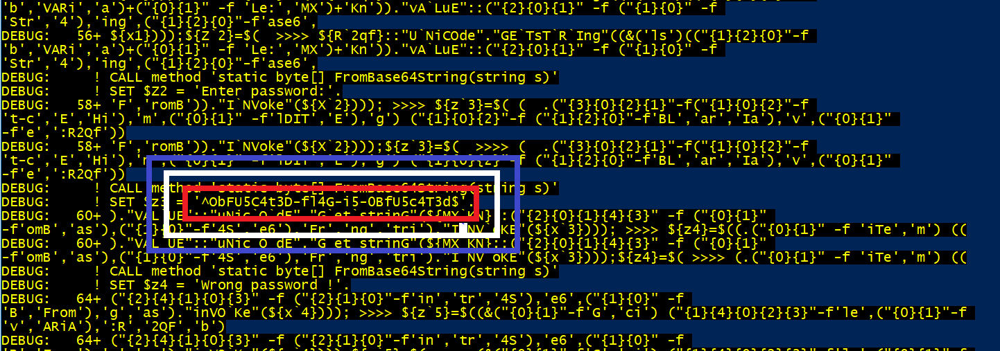

# NDH wargame 2018 : reverse 850

**Category:** reverse |
**Name:** dans la vallee |
**Solves:** 0 |
**Description:** Reverse a machine learning model embeded in an ELF binary.

___
## TLDR

This challenge is about reversing a powershell script to find a flag. The was asking for a password from the standard input and we have to find this password.

Here is an extract of the 29KB powershell script, there are a lot of weird things happening in there.
```
M-bM-^VM-^HM-bM-^VM-^HM-bM-^VM-^HM-bM-^VM-^HM-bM-^VM-^HM-bM-^VM-^HM-bM-^VM-^HM-bM-^VM-^HM-bM-^VM-^HM-bM-^VM-^HM-bM-^VM-^HM-bM-^VM-^HM-bM-^VM-^HM-bM-^VM-^HM-bM-^VM-^HM-bM-^VM-^HM-bM-^VM-^HM-bM-^VM-^HM-bM-^VM-^HM-bM-^VM-^HM-bM-^VM-^HM-bM-^VM-^HM-bM-^VM-^HM-bM-^VM-^HM-bM-^VM-^HM-bM-^VM-^HM-bM-^VM-^HM-bM-^VM-^HM-bM-^VM-^HM-bM-^VM-^HM-bM-^VM-^HM-bM-^VM-^HM-bM-^VM-^HM-bM-^VM-^HM-bM-^VM-^HM-bM-^VM-^HM-bM-^VM-^HM-bM-^VM-^HM-bM-^VM-^HM-bM-^VM-^HM-bM-^VM-^HM-bM-^VM-^HM-bM-^VM-^HM-bM-^VM-^HM-bM-^VM-^HM-bM-^VM-^HM-bM-^VM-^HM-bM-^VM-^HM-bM-^VM-^HM-bM-^VM-^HM-bM-^VM-^HM-bM-^VM-^HM-bM-^VM-^HM-bM-^VM-^HM-bM-^VM-^HM-bM-^VM-^HM-bM-^VM-^HM-bM-^VM-^HM-bM-^VM-^HM-bM-^VM-^HM-bM-^VM-^HM-bM-^VM-^HM-bM-^VM-^HM-bM-^VM-^HM-bM-^VM-^HM-bM-^VM-^HM-bM-^VM-^HM-bM-^VM-^HM-bM-^VM-^HM-bM-^VM-^HM-bM-^VM-^HM-bM-^VM-^HM-bM-^VM-^HM-bM-^VM-^HM-bM-^VM-^HM-bM-^VM-^HM-bM-^VM-^HM-bM-^VM-^HM-bM-^VM-^HM-bM-^VM-^HM-bM-^VM-^HM-bM-^VM-^HM-bM-^VM-^HM-bM-^VM-^HM-bM-^VM-^HM-bM-^VM-^HM-bM-^VM-^HM-bM-^VM-^HM-bM-^VM-^HM-bM-^VM-^HM-bM-^VM-^HM-bM-^VM-^H#>^M$
'R');.("{2}{1}{0}" -f ("{1}{0}" -f'ost',("{0}{1}"-f'te','-H')),'i','Wr') "";${iNP`UT}=${z5}}else{ ${I`NpUT}="ok";.("{2}{1}{0}" -f("{0}{1}" -f ("{0}{1}"-f 'e','-Ho'),'st'),'it','Wr') ${Z6} -ForegroundColor (^M$
<#M-bM-^VM-^HM-bM-^VM-^HM-bM-^VM-^HM-bM-^VM-^HM-bM-^VM-^HM-bM-^VM-^HM-bM-^VM-^HM-bM-^VM-^HM-bM-^VM-^HM-bM-^VM-^HM-bM-^VM-^HM-bM-^VM-^HM-bM-^VM-^HM-bM-^VM-^HM-bM-^VM-^HM-bM-^VM-^HM-bM-^VM-^HM-bM-^VM-^HM-bM-^VM-^HM-bM-^VM-^HM-bM-^VM-^HM-bM-^VM-^HM-bM-^VM-^HM-bM-^VM-^HM-bM-^VM-^HM-bM-^VM-^HM-bM-^VM-^HM-bM-^VM-^HM-bM-^VM-^HM-bM-^VM-^HM-bM-^VM-^HM-bM-^VM-^HM-bM-^VM-^HM-bM-^VM-^HM-bM-^VM-^HM-bM-^VM-^HM-bM-^VM-^HM-bM-^VM-^HM-bM-^VM-^HM-bM-^VM-^HM-bM-^VM-^HM-bM-^VM-^HM-bM-^VM-^HM-bM-^VM-
```

# Solution:

type "Set-PSDebug -Trace 2" before running the script to enable debugging, it will print out all used variables value.



----
[HexpressoTeam](https://twitter.com/HexpressoCTF)

Players: [zma](https://twitter.com/_zm_a), [zbetcheckin](https://twitter.com/zbetcheckin), [XeR](https://github.com/XeR), [rawger](https://twitter.com/_rawger), [pix](https://twitter.com/pix), [jet](https://twitter.com/___jet_), [dev2lead](https://twitter.com/dev2lead), [chaignc](https://twitter.com/chaignc), [bitk](https://twitter.com/BitK_), Beuc


Set-PSDebug -Trace 2
import-Module .\ghostinthepowershell.ps1
